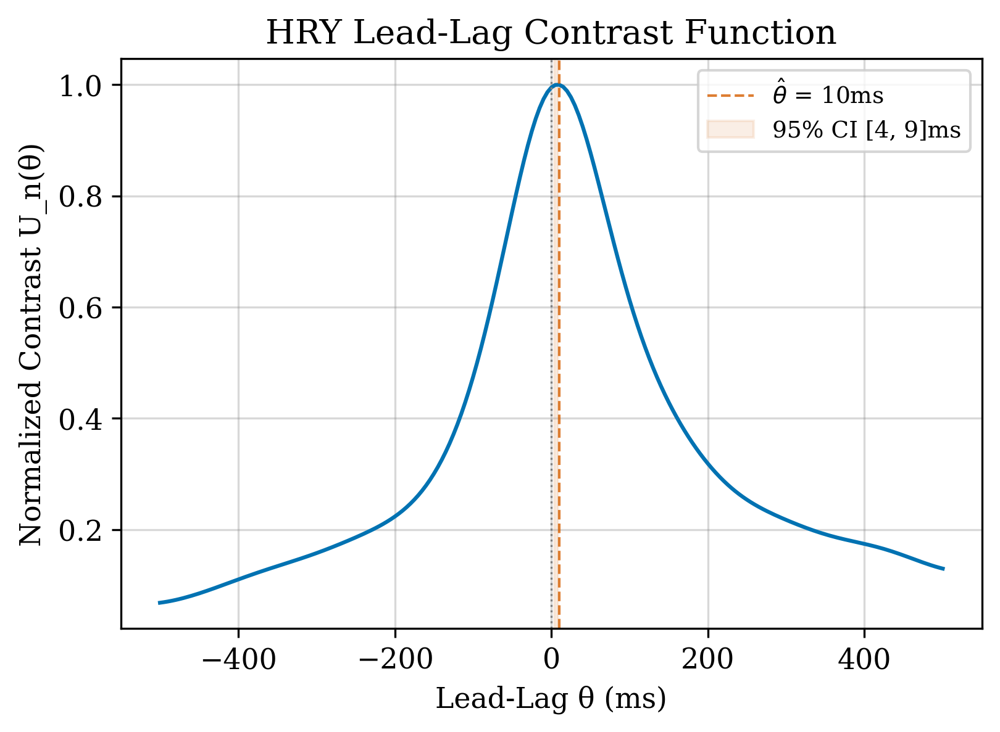
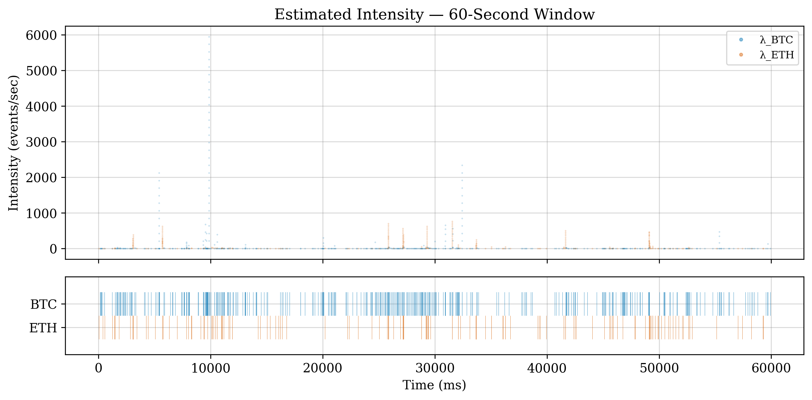

# Crypto Tick Microstructure

High-frequency covariance estimation and lead-lag analysis for Bitcoin-Ethereum using tick-level Binance data.

## Overview

This project implements microstructure-aware statistical methods to analyze ultra-high-frequency dependence between BTC and ETH. It processes ~7 days of tick-level aggTrades data (~50M+ trades) and applies econometric techniques designed for asynchronous, noisy price observations.

### Key Findings

| Method | Result |
|--------|--------|
| **Lead-Lag** | BTC leads ETH by ~10ms (t-stat = 7.86, p < 0.001) |
| **Granger Causality** | Bidirectional; BTC→ETH F = 13,100 at 100ms lag |
| **Information Share** | BTC contributes 86% of price discovery at 5-sec scale |
| **Predictability** | OOS R² = 1.9% at 100ms horizon; half-life ~500ms |
| **Hawkes Excitation** | Cross-excitation α ≈ 0.24–0.54; spectral radius 0.55–0.74 |

### Methods Implemented

- **Hayashi-Yoshida Covariance** — Bias-free estimation for non-synchronous observations
- **HRY Lead-Lag Contrast** — Asymmetric covariance to detect which asset leads
- **Granger Causality** — VAR-based causality testing at multiple lags
- **VECM Information Shares** — Hasbrouck decomposition of price discovery
- **Predictive Regression** — Out-of-sample R² with transaction cost analysis
- **Bivariate Hawkes Process** — Marked point process with exponential kernels for trade arrival modeling

## Results

### Epps Effect & Optimal Frequency


Correlation collapses at high frequencies due to asynchronous trading—the classic Epps effect. The Hayashi-Yoshida estimator recovers true covariance without requiring time synchronization.

### Lead-Lag Structure



The HRY contrast function peaks at +10ms, indicating BTC price changes systematically precede ETH. Bootstrap confidence intervals (200 iterations, day-level blocks) confirm significance.

### Hawkes Intensity Dynamics



Trade arrivals exhibit mutual excitation: a BTC trade temporarily increases ETH arrival intensity and vice versa. The bivariate Hawkes model captures this clustering with exponential decay kernels.

## Installation

```bash
git clone https://github.com/rohit661x/crypto-tick-microstructure.git
cd crypto-tick-microstructure
pip install -r requirements.txt
```

**Requirements:** Python 3.9+, pandas, numpy, scipy, statsmodels, numba, matplotlib, pyarrow, requests

## Usage

### 1. Data Collection

```bash
python scripts/collect_data.py      # Download 7 days of Binance aggTrades
python scripts/validate_data.py     # Clean and convert to parquet
```

Downloads ~900MB of raw tick data from Binance's public data archive.

### 2. Analysis Pipeline

```bash
# Core analysis
python analysis/scripts/01_resample_data.py
python analysis/scripts/13_hayashi_yoshida.py
python analysis/scripts/14_lead_lag_contrast.py
python analysis/scripts/15_granger_causality.py
python analysis/scripts/16_information_share.py
python analysis/scripts/17_predictive_regression.py
python analysis/scripts/18_strategy_backtest.py

# Hawkes process module
python analysis/scripts/20_hawkes_estimation.py
python analysis/scripts/21_hawkes_diagnostics.py
python analysis/scripts/22_hawkes_inference.py
python analysis/scripts/23_hawkes_simulation.py

# Generate report
python analysis/scripts/19_generate_report.py
```

### 3. Outputs

- `analysis/results/` — CSV files with parameter estimates, test statistics, confidence intervals
- `analysis/figures/` — Publication-ready PNG/PDF figures

## Project Structure

```
├── scripts/                    # Data pipeline
│   ├── collect_data.py         # Binance aggTrades downloader
│   ├── validate_data.py        # Cleaning & parquet conversion
│   └── summary_stats.py        # Descriptive statistics
├── analysis/
│   ├── scripts/                # Numbered analysis pipeline
│   │   ├── 01_resample_data.py
│   │   ├── 13_hayashi_yoshida.py
│   │   ├── 14_lead_lag_contrast.py
│   │   ├── 15_granger_causality.py
│   │   ├── 16_information_share.py
│   │   ├── 17_predictive_regression.py
│   │   ├── 18_strategy_backtest.py
│   │   ├── 20_hawkes_estimation.py
│   │   ├── 21_hawkes_diagnostics.py
│   │   ├── 22_hawkes_inference.py
│   │   └── 23_hawkes_simulation.py
│   ├── results/                # Output CSVs
│   └── figures/                # Generated plots
├── data/
│   ├── raw/                    # Raw CSV (~450MB each)
│   └── processed/              # Cleaned parquet (~110MB each)
└── docs/plans/                 # Design documents
```

## Technical Highlights

- **Numba JIT compilation** for O(N) Hayashi-Yoshida computation on 50M+ tick pairs
- **Memory-efficient processing** via day-by-day chunking of multi-GB datasets
- **Bootstrap inference** using day-level block resampling (200 iterations)
- **Recursive likelihood** for O(N) Hawkes MLE via chronological event interleaving
- **Numerical stability** with expm1/log1p for microsecond timestamp deltas

## References

- Hayashi & Yoshida (2005) — Covariance estimation for non-synchronous observations
- Hoffmann, Rosenbaum & Yoshida (2013) — Lead-lag detection via HRY contrast
- Hasbrouck (1995) — Information shares in price discovery
- Hawkes (1971) — Self-exciting point processes

## License

MIT
